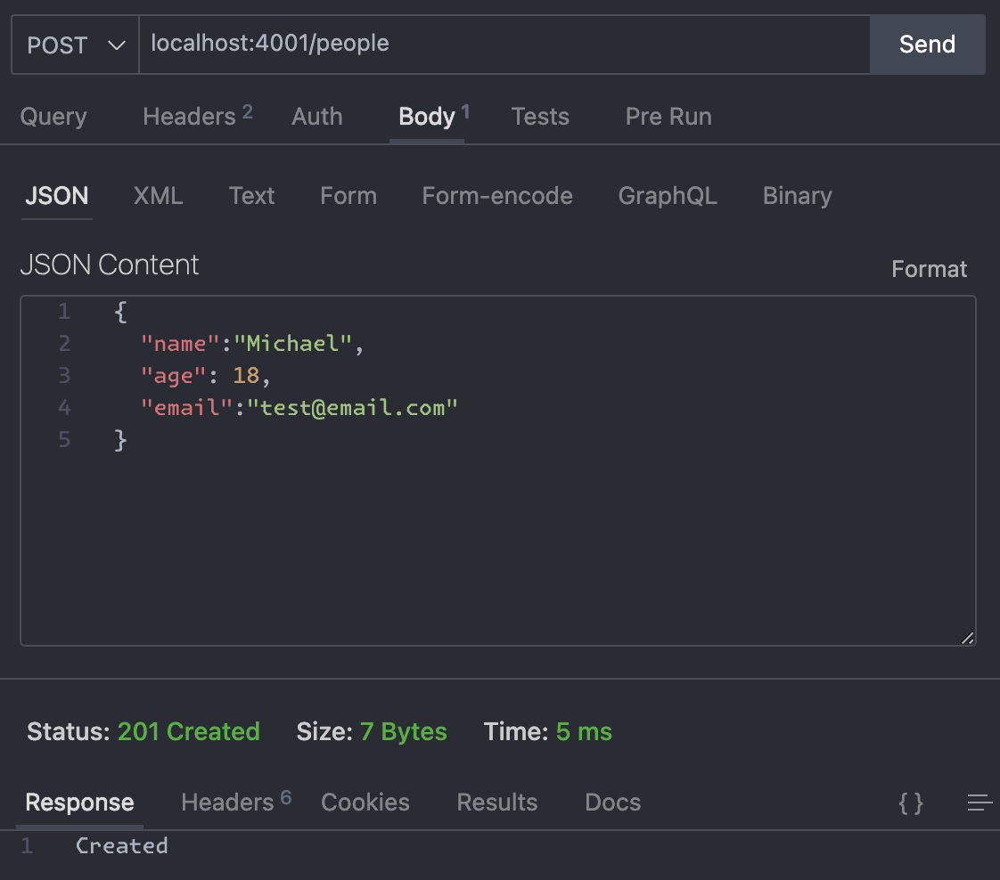
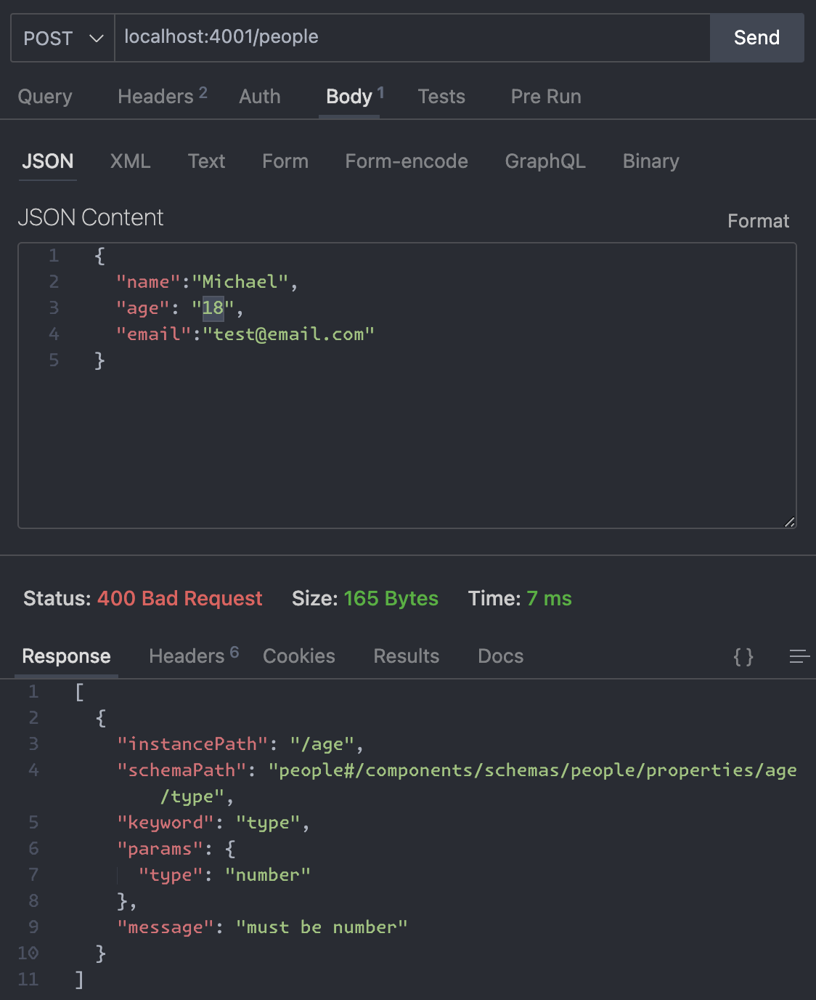
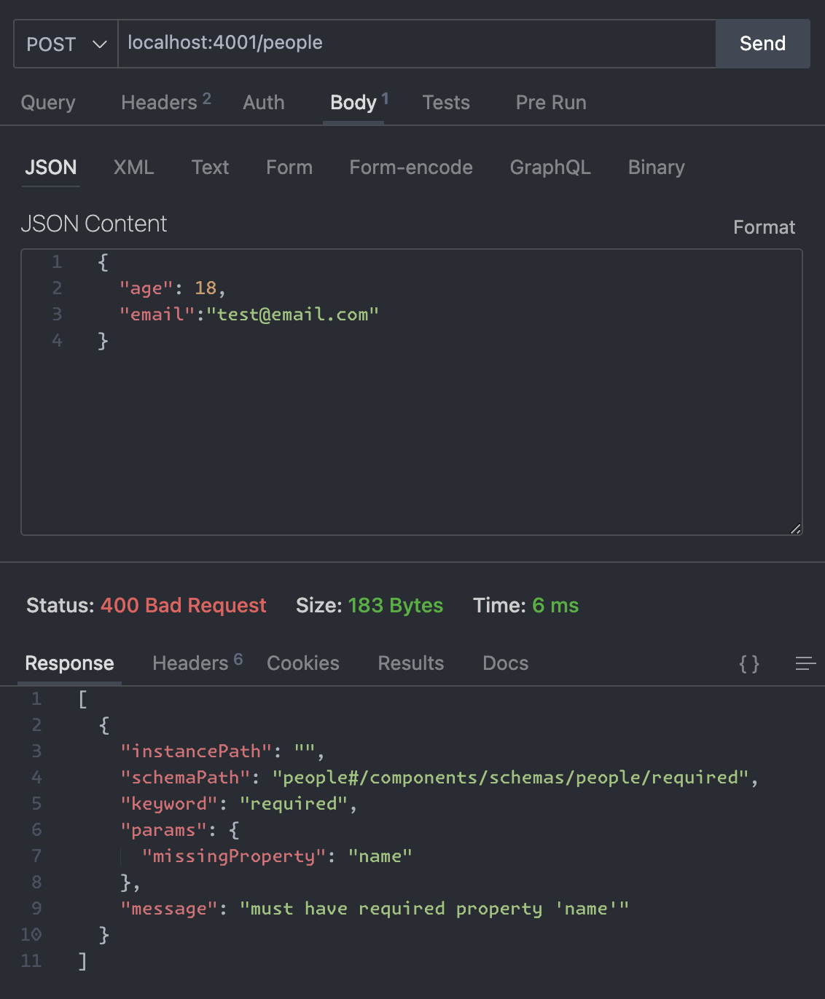

# Sample Data Contracts (JS)

## about

- This repo is for demonstrating how to create and validate data contracts using nodejs & openapi.
- It is written aside blogs described below.

## blog related

- [EN] [Data contracts in (real-time) action (with NodeJS)](https://www.bluebirz.net/en/data-contracts-in-real-time-action-with-nodejs/)
- [TH] [สัญญา(ไม่)ปากเปล่า - data contracts in action (NodeJS)](https://www.bluebirz.net/th/data-contracts-in-real-time-action-with-nodejs-th/)
- [Medium] [Data contracts in (real-time) action (with NodeJS)](https://medium.com/@bluebirz/data-contracts-in-real-time-action-with-nodejs-4f428d303703)

## How to run

### Prerequisites

- [nodejs](https://nodejs.org/en/download)

### Executions

1. install packages via
  
    ```shell
    cd sample-data-contracts-js
    npm install
    ```

1. start node using

    ```shell
    npm run start
    ```

1. the api will be ready on port 4001
1. try call the api using tools e.g. postman or curl

    ```shell
    curl --location 'localhost:4001/people' \
        --header 'Content-Type: application/json' \
        --data-raw '{
        "name": "Michael",
        "age": 18,
        "email": "test@email.com"
        }'
    ```

    ```shell
    curl --location 'localhost:4001/pets' \
        --header 'Content-Type: application/json' \
        --data-raw '{
        {
        "name":"rocky",
        "age": 2,
        "ownerName": "Richard"
        }'
    ```

### Test result examples

- `/people`: ok

- `/people`: wrong types

- `/people`: missing required fields

- `/pets`: missing required fields

